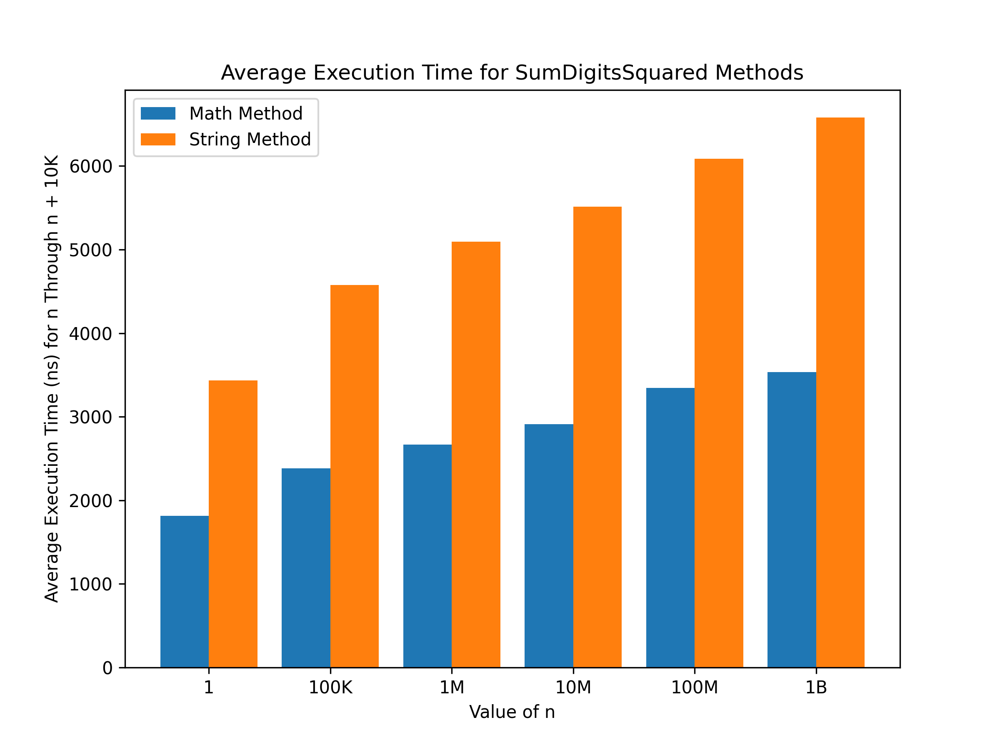

# Sum Digits Squared Test

Programmers often have to manipulate numbers. Sometimes this can be accomplished by only performing mathematical operations and avoiding type conversions. Other times, converting the number to a different datatype such as a string seems like the best approach. Often, the string conversion method is more readable but comes with concerns that it is slower.

## Problem
The specific problem used in this experiment is:

Calculate the sum of the squares of the digits of an integer.

Example: `25 -> 2^2 + 5^5 = 4 + 25 = 29`

## Two Approaches

### Math
```py
result = 0
while n > 0:
    last = n % 10
    result += last**2
    n = n // 10
return result
```

### String
```py
return sum([int(i) ** 2 for i in str(n)])
```

## Results
For integers in the 1 to 10K range, the string method is slightly faster. As the integer size increases past 10K, the math method is slightly faster. No significant difference between the methods was observed. Results are generalized and may vary between test runs.



## Conclusion
In Python, don't be deterred from converting numeric datatypes to strings if it will make your code more readable. For small numbers it may even be faster. The speed gains of the math method are not substantial enough to justify hard-to-read code.

## Install
Prequisites:
- [Git](https://git-scm.com/downloads)
- [Python3](https://www.python.org/downloads/)

1. In your terminal, run:
    ```bash
    git clone https://github.com/zgstumpf/sumdigitssquared.git
    cd sumdigitssquared
    ```
1. Install dependencies in a virtual environment.

    (Preferred) If you use Conda, in the same terminal, run:
    ```bash
    conda create --file requirements_conda.txt -n sumdigitssquared -y
    conda activate sumdigitssquared
    ```

    Or, if you use venv (Python's default environment manager), run:
    ```bash
    python3 -m venv venv
    source venv/bin/activate
    pip install -r requirements_pip.txt
    ```

1. Run the code. In the same terminal, run:
    ```bash
    python3 main.py
    ```

## Cleanup
To remove this project from your device:

1. Delete the `sumdigitssquared` folder
2. If you used Conda, run:
    ```bash
    conda deactivate sumdigitssquared
    conda remove -n sumdigitssquared --all -y
    ```